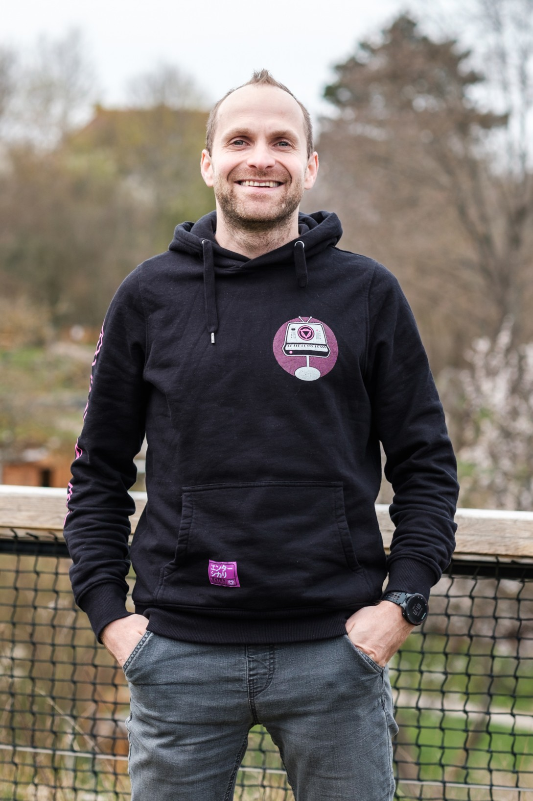

# Petr Skřivánek — Portfolio Web
## Jak spustit web na vlastní doméně přes GitHub Pages (zdarma)

---

### KROK 1 — Připrav soubory

Složka projektu bude vypadat takto:
```
petrskrivanek-web/
├── index.html       ← hlavní soubor (tento web)
├── foto.jpg         ← tvoje fotka (nahraď placeholder v HTML)
└── README.md        ← tento návod
```

**Fotku** vlož do HTML místo placeholderu:
Najdi tuto část v index.html a nahraď ji:
```html
<div class="photo-frame-placeholder">🧑‍💻</div>
```
Tímto:
```html

```

---

### KROK 2 — Založ GitHub repozitář

1. Jdi na **github.com** a přihlas se (nebo založ účet zdarma)
2. Klikni **New repository**
3. Název: `petrskrivanek-web`
4. Nastav jako **Public**
5. Klikni **Create repository**

---

### KROK 3 — Nahraj soubory

**Přes prohlížeč (nejjednodušší):**
1. V repozitáři klikni **uploading an existing file**
2. Přetáhni `index.html` a `foto.jpg`
3. Klikni **Commit changes**

---

### KROK 4 — Zapni GitHub Pages

1. Settings → **Pages**
2. Source: **Deploy from a branch** → branch: **main**
3. Klikni **Save**
4. Web bude live na: `https://TVOJE-JMENO.github.io/petrskrivanek-web/`

---

### KROK 5 — Přidej vlastní doménu

**Cena domény:** ~150–300 Kč/rok u Wedos.cz nebo Forpsi.cz
**Hosting:** ZDARMA navždy

**DNS záznamy** (nastav u registrátora domény):

A záznamy:
```
185.199.108.153
185.199.109.153
185.199.110.153
185.199.111.153
```

CNAME:
```
www → TVOJE-JMENO.github.io
```

V GitHub Pages → Custom domain zadej `petrskrivanek.cz`
Vytvoř soubor `CNAME` v repozitáři s obsahem: `petrskrivanek.cz`
Zaškrtni **Enforce HTTPS** — SSL certifikát je zdarma automaticky. ✅

DNS se propaguje 15 min – 48 hodin.

---

### Použité písmo: Fraunces

**Fraunces** je open-source variabilní display serif od Undercase Type Foundry.
Originální, neotřelé, zdarma přes Google Fonts.
→ fonts.google.com/specimen/Fraunces

UI text: **Inter** — čitelný, moderní, taktéž zdarma.

---

### Calendly

V index.html najdi a nahraď `https://calendly.com/petr-skrivanek` svým skutečným odkazem.